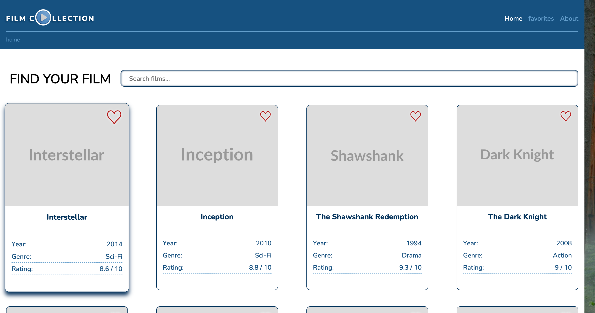
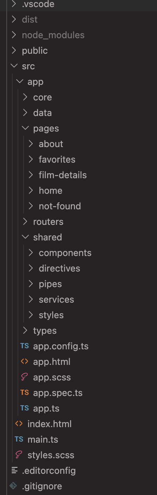

# 🎬 Film Collection

🚀 **Live Demo:** [Open App](https://film-collection-ng.netlify.app/)

A simple Angular application that allows users to browse, search, and explore a collection of movies.

---

## 🚀 Features

- 🔍 Real-time film search

- 🎞 Detailed movie page

- ❤️ Add/remove favorites

- 🧭 Breadcrumb navigation

- ⚡ Built with Angular Signals (no RxJS)

---

## 🖼 Preview

### 🏠 Home Page



### 📁 Project Structure



---

## 🧠 Technologies

- Angular (standalone components)

- TypeScript (strict mode)

- Angular Signals

- SCSS

- Custom Pipes & Directives

---

## 📦 Project Structure

src/
├── app/
│   ├── core/        # business logic & services
│   ├── data/        # mock data
│   ├── pages/       # pages (home, about, details, etc.)
│   ├── shared/      # reusable components, pipes, directives
│   ├── types/       # interfaces
│   └── routers/     # routing config

---

## ⚙️ Installation

```bash
-> npm install
```

## ▶️ Run the project
```bash
-> ng serve
```
### Open in browser:
```bash
http://localhost:4200
```

## 🧩 Key Concepts

This project demonstrates:

* Angular Signals for state management
* Computed values for reactive filtering
* Standalone components architecture
* Routing with dynamic parameters
* Custom directive (autofocus)
* Custom pipe (duration formatting)

## 📌 Notes

* All data is mock data (no backend)
* No RxJS is used — only Angular Signals
* Focus is on clean architecture and UI interaction

## 👨‍💻 Author
Artur Tamashevich
